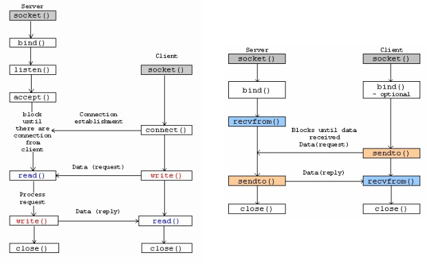

# crawler-coolpc
  A simple tutorial about crawler with node.js
  
---
### __Socket__

  #### Socket 是網路溝通的流程。

  __Server__ 對指定的 __port__ 偵聽等待 __Client__ 連接， __Client__ 連接後開始傳送資料， __Server__ 將資料接收後回覆 __Client__ 並關閉連接。

  

---
### __HTTP__

  為 __OSI model__ Layer 7(應用層)之應用，基於 __Socket__ 交換資料，並將資料加以規範。
